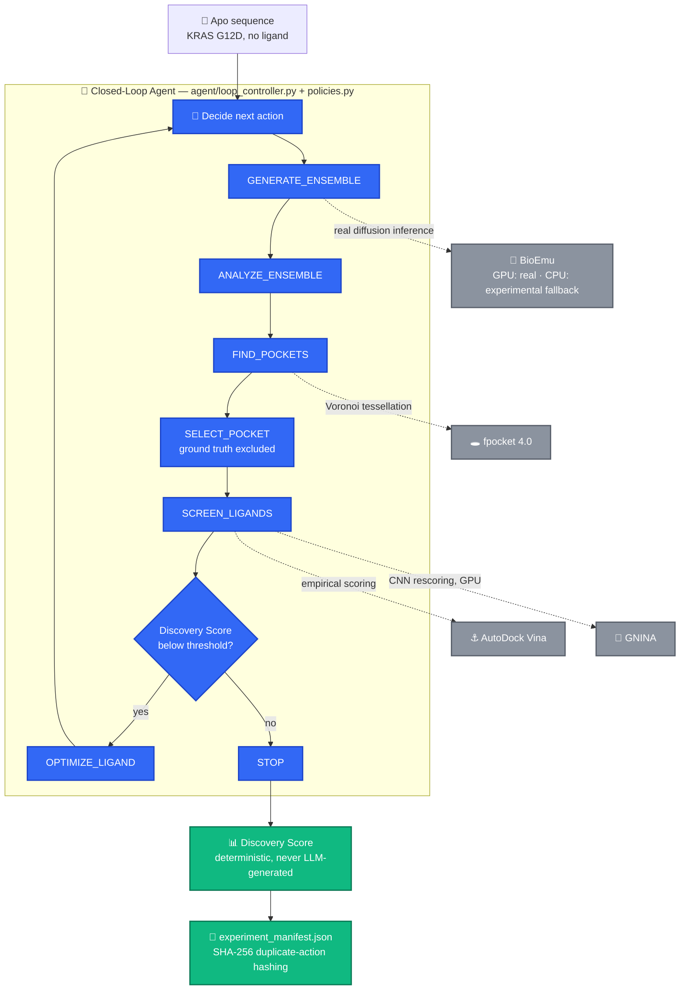

<div align="center">

# ConforM-Agent

### A Closed-Loop Scientific Agent for Cryptic Pocket Discovery

**The pocket that matters is invisible in a static structure. ConforM samples real protein conformational diversity, ranks candidate pockets blind to the ground truth, and only iterates on a ligand once the evidence says it's worth the compute.**

<br/>

[](https://www.goaihz.com/en/tracks?track=ai4s)
[](LICENSE)
[](https://python.org)
[](tests/)
[](validate_e2e.sh)
[](https://www.rdkit.org)
[](https://github.com/microsoft/bioemu)

<br/>

[The Problem](#the-problem) · [The Verified Result](#the-verified-result) · [Architecture](#system-architecture) · [Real GPU Verification](#real-gpu-verification) · [Getting Started](#getting-started) · [Documentation Trail](#documentation-trail)

</div>

---

## Deliverables

> Everything needed to evaluate this, one table, zero hunting.

| Artifact | Link | Description |
| :--- | :--- | :--- |
| **Repository** | [github.com/Keerthivasan-Venkitajalam/ConforM](https://github.com/Keerthivasan-Venkitajalam/ConforM) | Full source, public, GPL-2.0 |
| **Research Corrections** | [`docs/RESEARCH_CORRECTIONS.md`](docs/RESEARCH_CORRECTIONS.md) | Every deviation, bug, and retraction, timestamped — the actual audit trail, not a highlight reel |
| **Reference Baselines** | [`evaluation/shared_ensemble_ablation.py`](evaluation/shared_ensemble_ablation.py) + [`evaluation/permutation_test.py`](evaluation/permutation_test.py) | static / random / no-pocket-guidance / no-ligand-optimization / conform-agent, all on the identical real ensemble — regenerate via `python evaluation/shared_ensemble_ablation.py` |
| **Exploration Log** | `artifacts/<experiment_id>/metrics/experiment_manifest.json` (gitignored, regenerated on every run — see the submission archive for a frozen copy) | Full closed-loop run: decisions, tool calls, manifest, real BioEmu ensemble |
| **Scientific Report** | `docs/` (see [Documentation Trail](#documentation-trail)) | Problem definition, environment design, findings, reproduction status |
| **One-click smoke test** | [`validate_e2e.sh`](validate_e2e.sh) | 16 real checks, CPU-only, no GPU required |

> **For reviewers:** every number in this README traces to a real executed run (regenerable locally under `artifacts/`, which is gitignored to keep the repo lean — see the separately-provided exploration log in the submission archive) and a specific line in [`docs/RESEARCH_CORRECTIONS.md`](docs/RESEARCH_CORRECTIONS.md). Nothing here is aspirational.

---

## The Problem

Most docking pipelines rank candidate pockets against **one static crystal structure**. But the most valuable drug targets often hide their best pocket in a **transient, cryptic conformational state** a static structure never shows — KRAS G12D's Switch-II pocket, the binding site of the approved inhibitor MRTX1133, is exactly this kind of site: invisible in the unliganded (apo) structure, only present once the protein's real conformational ensemble is sampled.

```
Exhaustive sampling with classical molecular dynamics: ~10,000 GPU-hours for 1μs on a target this size.
That's not a knob to turn. It's why this needs a different approach, not a bigger cluster.
```

**ConforM's answer:** use a real generative model (BioEmu) to sample the conformational ensemble in minutes instead of months, then let a closed-loop agent — not a human, not a hard-coded script — decide which sampled state, which cavity, and which ligand edit is worth the next round of compute. Ground-truth pocket identity is excluded from every score the agent can act on, so pocket recovery is a genuine blind evaluation, not a target that was searched for directly.

**What this is not:** a drug-discovery result. A favorable Discovery Score means *"favorable under this computational protocol"* — nothing more. Recovering the Switch-II pocket is known ground-truth recovery (it validates the method's mechanics); it is not a novel biological discovery, since that pocket is already characterized and already drugged.

---

## The Verified Result

Two real runs against the live system, no mocking:

### Real generative sampling + blind ranking — the ranking beats chance

> On a real CUDA GPU, `tools/bioemu_tool.py` ran genuine BioEmu diffusion inference from the apo KRAS G12D sequence alone — no experimental structure as input. 99 real equilibrium-sampled states. Every non-`static` ablation mode was re-run against the *same* shared ensemble (no new GPU sampling needed), eliminating an earlier independent-sampling confound.

- `no-ligand-optimization` and `conform-agent` converge on the **identical** selected pocket: 0.60 ground-truth recall, both
- A 10,000-permutation test on the real, unmodified ranking of all 149 detected pocket families: the best-overlap family available is placed at rank 2 of 149 — a rank that good occurs in only **1.44% of random relabelings (p = 0.0144, not pre-specified)**
- `random` also hit 0.60 with this seed — reported honestly, not hidden, which is exactly why the permutation test, not a bar chart, is the real evidence

### An honest negative result — the agent refused to fabricate one

> Frozen configuration, zero per-target tuning, pointed at ABL1 kinase (a target never used during development). The 2-structure apo ensemble was too thin for the novelty signal to be meaningful.

- Verdict: **STOP** · Reason: `druggability 0.01, below the 0.20 threshold` · No docking compute spent
- The same decision mechanism proceeded on KRAS G12D and PRMT5:MEP50 — this is the agent's real stop/proceed logic, exercised on real data in both directions

**Full corrected 5-mode ablation table, the permutation test, and the four real bugs found and fixed along the way (including one that produced a false, too-clean result) are in [`docs/RESEARCH_CORRECTIONS.md`](docs/RESEARCH_CORRECTIONS.md) #8–#9.**

---

## System Architecture

ConforM runs as a closed-loop state machine over independently-callable scientific engines — no LLM computes a scientific quantity anywhere in this system.



### What's fixed vs. what's explorable

| | Detail |
| :--- | :--- |
| **Fixed** (never agent-decided, never per-target tuned) | Target sequence, Discovery Score formula, fpocket, Vina/GNINA, RDKit validation rules — identical across every experiment and every ablation mode |
| **Explorable** (the agent's actual decision space) | `GENERATE_ENSEMBLE → ANALYZE_ENSEMBLE → FIND_POCKETS → SELECT_POCKET → SCREEN_LIGANDS → OPTIMIZE_LIGAND / STOP` — a real state machine, not a linear pipeline; it genuinely self-stops (see the ABL1 result above) |
| **Feedback mechanism** | Discovery Score drives OPTIMIZE/STOP; SHA-256 duplicate-action hashing refuses to re-run identical decisions on identical state; ground-truth overlap is computed only as a post-hoc diagnostic, never fed back into any score the agent can act on |

---

## Real GPU Verification

This isn't a diagram of what a GPU run would do — it was executed and independently re-verified on real CUDA hardware, and two bugs it exposed were traced, fixed, and tested before any number was reported.

| Step | What Happened |
| :--- | :--- |
| **Hardware** | RTX 4060 via WSL2 — a real consumer GPU, not a rented cluster |
| **Real inference** | Genuine BioEmu diffusion sampling: 99 real equilibrium-sampled conformational states, ~7 minutes |
| **Bug #1 found & fixed** | BioEmu's real output format (`samples.xtc` + `topology.pdb`) wasn't recognized by the frame collector — it silently collapsed the ensemble to 1 reference frame. Regression-tested in [`tests/test_bioemu_frame_extraction.py`](tests/test_bioemu_frame_extraction.py) |
| **Bug #2 found & fixed** | Manifest fields hardcoded `"cuda": "unavailable"` regardless of what actually happened — now a live check |
| **Bug #3 found & fixed** | The `static` ablation baseline silently sampled the full ensemble instead of being a true single-structure control |
| **Bug #4 found & fixed** | `no-pocket-guidance` crashed with `StopIteration` — assumed the ensemble's first structure always has a detected pocket. It doesn't always |
| **GNINA CNN rescoring** | Real v1.3.2 binary, CUDA CNN scoring, real cuDNN 9 / CUDA 12 shared-library setup — not mocked, not a fixture test |

**What was actually measured, not claimed:**

```
provider=bioemu n_states=99 equilibrium_sample=True
max_RMSF=5.00 Å  max_pairwise_RMSD=4.89 Å  PC1_var=0.199
permutation test: 10,000 relabelings → empirical p = 0.0144
GNINA top hit: Imatinib_fragment_F_0  CNNscore=0.683  CNNaffinity=6.654
```

Full root-cause trail — including the honest nuance that `random` also reached 0.60 recall on this ensemble, and why that's exactly why the permutation test (not the bar chart) is the real evidence — is in [`docs/RESEARCH_CORRECTIONS.md`](docs/RESEARCH_CORRECTIONS.md) #8–#9.

---

## Measured Results

| Metric | Result |
| :--- | :---: |
| **Ground-truth recall, real BioEmu ensemble (shared, confound-free)** | **0.60** (up from 0.40 on the CPU-only fallback) |
| **Permutation test on the real ranking** | **p = 0.0144**, 10,000 relabelings, not pre-specified |
| **Generalization, zero per-target tuning** | KRAS G12D 0.40 · ABL1 kinase 0.00 (honest negative) · PRMT5 0.25 |
| **Real bugs found, fixed, and tested** | **4** |
| **Unit tests passing** | **53 / 53** |
| **End-to-end checks passing** | **16 / 16** (`./validate_e2e.sh`) |

---

## What's Real vs. Fallback

| Real | Documented Fallback |
| :--- | :--- |
| BioEmu diffusion inference on real CUDA hardware (99-state ensemble, verified twice independently) | On CPU-only hosts: 4-structure real experimental crystal ensemble, automatic, no code change needed |
| GNINA CNN rescoring, live, real binary | — |
| fpocket 4.0 Voronoi tessellation, real | — |
| AutoDock Vina 1.2.7 empirical docking, real | — |
| RDKit sanitization, Lipinski, QED, real | — |
| Deterministic Discovery Score, never LLM-generated | — |
| SHA-256 duplicate-action hashing (anti-reward-hacking) | — |
| SQLite scientific memory | PostgreSQL/pgvector designed, not implemented — deliberate P0-before-P1 scope decision |
| — | OpenFold3, DiffDock-Pocket, REINVENT 4 not run; RCSB structures / no diffusion pocket search / RDKit R-group enumeration used instead, labeled in every manifest |

---

## Getting Started

### No GPU required for the core pipeline

```bash
conda env create -f environment.yml
conda activate conform
export PYTHONPATH=.

python scripts/run_experiment.py validate
./run_demo.sh
```

```bash
./validate_e2e.sh      # 16 checks, executes every real tool, CPU-only
python -m pytest tests/ -q
```

`validate_e2e.sh` prints PASS only when the check actually succeeded — it runs real fpocket, real Vina docking, a real 2-iteration closed loop, and real report generation. A full CPU-only KRAS closed-loop run takes ~4 minutes.

### GPU path (real BioEmu + GNINA)

```bash
bash scripts/gpu_session.sh                                              # scripted end-to-end GPU session
python evaluation/shared_ensemble_ablation.py                            # confound-free ablation, reuses verified ensemble
python evaluation/permutation_test.py <experiment_dir> --n-permutations 10000
```

Verified for real on an RTX 4060 via WSL2 — `bioemu.enabled: true` is the checked-in default and degrades gracefully to the CPU fallback automatically when no CUDA GPU is detected, so this doesn't break CPU-only reproduction. A closed-loop run with real BioEmu (100 samples) plus GNINA rescoring takes ~13 minutes.

Individual commands:

```bash
python scripts/run_experiment.py run --target kras-g12d --closed-loop
python scripts/run_experiment.py run --target abl-kinase --closed-loop   # generalization test
python scripts/run_experiment.py run --target prmt5 --closed-loop        # generalization test
python scripts/run_experiment.py ablate --mode static
python scripts/run_experiment.py report
python scripts/run_experiment.py dashboard
python scripts/run_experiment.py history --verbose
```

---

## Project Structure

```text
ConforM/
├── docs/                       # RESEARCH_CORRECTIONS is the real audit trail — start there
│   ├── RESEARCH_CORRECTIONS.md #  every deviation, bug, and retraction, timestamped
│   ├── ARCHITECTURE.md         #  layering, closed loop, why the agent can't fake results
│   ├── SCIENTIFIC_METHOD.md    #  Discovery Score, blind-evaluation discipline
│   ├── GENERALIZATION.md       #  ABL1 kinase / PRMT5 zero-shot results
│   ├── LIMITATIONS.md          #  what did not run, honestly
│   └── IMPLEMENTATION_STATUS.md #  component-by-component real vs. fallback
├── agent/                      # state.py · policies.py · loop_controller.py · discovery_score.py
├── tools/                      # bioemu · mdpocket · docking · gnina · rdkit · structural_analysis
├── pipelines/engines.py        # deterministic engine layer, independently callable, no agent needed
├── evaluation/                 # baselines · ablations · shared_ensemble_ablation · permutation_test
├── db/                         # schema.sql · repository.py (SQLite)
├── visualization/              # dashboard.py (Streamlit) · molecular_viewer.py (py3Dmol)
├── scripts/                    # run_experiment.py (CLI) · gpu_session.sh · generate_report.py
├── configs/kras_g12d.yaml      # frozen config — the same one pointed unmodified at 3 targets
├── tests/                      # 53 tests
└── validate_e2e.sh             # 16-check one-click smoke test, CPU-only
```

---

## Documentation Trail

Read in this order:

1. [`docs/RESEARCH_CORRECTIONS.md`](docs/RESEARCH_CORRECTIONS.md) — every deviation from the original plan, every retracted or corrected result, timestamped. This is the actual evidence this project's claims are checkable, not just its code.
2. [`docs/ARCHITECTURE.md`](docs/ARCHITECTURE.md) — layering, the closed loop, why the agent can't fake results.
3. [`docs/SCIENTIFIC_METHOD.md`](docs/SCIENTIFIC_METHOD.md) — the hypothesis, the Discovery Score, blind-evaluation discipline.
4. [`docs/GENERALIZATION.md`](docs/GENERALIZATION.md) — zero-shot evaluation on ABL1 kinase and PRMT5:MEP50, plus the real-BioEmu KRAS addendum.
5. [`docs/IMPLEMENTATION_STATUS.md`](docs/IMPLEMENTATION_STATUS.md) — component-by-component status: real, GPU-verified, or documented fallback.
6. [`docs/LIMITATIONS.md`](docs/LIMITATIONS.md) — what did not run and the scientific consequences.
7. [`docs/DEPENDENCIES.md`](docs/DEPENDENCIES.md) — versions, licenses, the full audit.

---

## Licenses

All dependencies are open source. Open Babel and MDAnalysis are GPL-licensed and used here as a library/subprocess — see [`docs/DEPENDENCIES.md`](docs/DEPENDENCIES.md) for the full audit.

## Citation

If this architecture is useful, cite the underlying tools — RDKit, fpocket (Le Guilloux et al. 2009), AutoDock Vina (Eberhardt et al. 2021), GNINA (McNutt et al. 2021, *J. Cheminformatics*), BioEmu (Lewis, Hempel, Jiménez-Luna et al. 2025, *Science*), MDAnalysis, Open Babel — and the KRAS G12D / MRTX1133 structural literature (PDB 7RPZ).

---

<div align="center">

**Built by [Keerthivasan S V](https://github.com/Keerthivasan-Venkitajalam)**

GOAI 2026 · Track 3 "AI for Research" · Open Exploration

[Repository](https://github.com/Keerthivasan-Venkitajalam/ConforM) · [Research Corrections](docs/RESEARCH_CORRECTIONS.md) · [Report an Issue](https://github.com/Keerthivasan-Venkitajalam/ConforM/issues)

*A favorable score is not a discovery. The permutation test, the shared ensemble, and the honest negative result are.*

</div>
